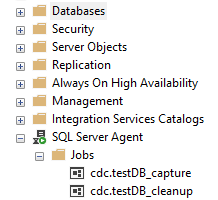
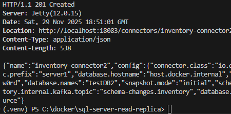
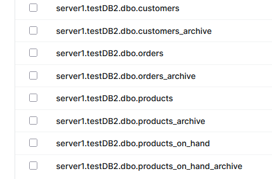
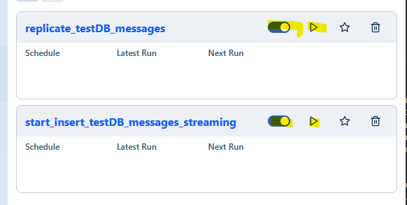

# (E)xtract - (L)oad of data using streaming with Kafka, Debezium, Spark and Airflow 

The goal for this project is to understand data streaming and practice it with a real-world use case. In this project, we will attempt to Extract and Load using data streaming with the following technologies:
    + Apache Spark: for preloading of existing data and streaming 
    + Apache Airflow: for orchestration
    + Apache Kafka: for streaming
    + Debezium: CDC stream connector to mssql server
    + Mssql Server: database for CDC

The source and destination databases are the same but these technologies supports other databases as well.  Also, this would be better if the source database is from a secondary replica server (https://github.com/debezium/debezium-examples/tree/main/sql-server-read-replica) so it does not interact with the transaction primary database.  But for practice purposes and also to minimize resources usage, I've just use primary database for CDC which is not dockerized.

The database schema is the same as the debezium sample above but I've added system-versioning on the tables for data version and also for data validation.  

Hardware Requirements:
+ At least 20gb disk space
+ At least 6-8gb available memory

Software Requirements:
+ SSMS - https://learn.microsoft.com/en-us/ssms/install/install
+ Sql Server Developer - https://www.microsoft.com/en-us/sql-server/sql-server-downloads
+ Docker - https://docs.docker.com/desktop/setup/install/windows-install/
+ Visual Studio Code - https://code.visualstudio.com/docs/setup/windows
+ Visual Studio Code Extensions 
  - Docker
  - Python

Relevant Documents:
+ Apache Spark 
  - Spark - https://spark.apache.org/docs/latest/api/python/getting_started/index.html
  - Spark Structured Streaming - https://spark.apache.org/docs/latest/streaming/index.html
+ Apache Airflow - https://airflow.apache.org/docs/apache-airflow/2.3.4/index.html
+ Apache Kafka
  - Kafka - https://kafka.apache.org/quickstart
  - Spark and Kafka Integration - https://spark.apache.org/docs/latest/streaming/structured-streaming-kafka-integration.html
+ Debezium
  - https://debezium.io/documentation/reference/stable/index.html
  - Sample: https://github.com/debezium/debezium-examples/tree/main/sql-server-read-replica
+ Docker
  - https://docs.docker.com/extensions/extensions-sdk/quickstart/

Some Instructions

Github:
+ Download this project

In SSMS
+ Create the source database in mssql server found here: debezium-sqlsserver-init\inventory.sql
+ Make sure Sql Server Agent is started:

+ Create the warehouse database in mssql server found here: debezium-sqlsserver-init\wh-inventory.sql
        
In Visual Studio Code terminal window
+ compose the application:
  docker compose up -d

+ start sql server connector
  curl -i -X POST -H "Accept:application/json" -H  "Content-Type:application/json" http://localhost:18083/connectors/ -d @register-sqlserver.json

  you should see something like this after registration:

+ the registration does not create topics without data, in this case, the topics for the archive tables is not yet created.  So we need to create them manually so it does not error in the dag:
  docker exec -it kafka bin/kafka-topics.sh --create --topic server1.testDB.dbo.customers_archive --bootstrap-server host.docker.internal:29093 --partitions 1 replication-factor 1
  docker exec -it kafka bin/kafka-topics.sh --create --topic server1.testDB.dbo.products_archive --bootstrap-server host.docker.internal:29093 --partitions 1 replication-factor 1
  docker exec -it kafka bin/kafka-topics.sh --create --topic server1.testDB.dbo.products_on_hand_archive --bootstrap-server host.docker.internal:29093 --partitions 1 replication-factor 1
  docker exec -it kafka bin/kafka-topics.sh --create --topic server1.testDB.dbo.orders_archive --bootstrap-server host.docker.internal:29093 --partitions 1 replication-factor 1
+ in the kafka-ui (http://localhost/ui/clusters/kafka-cluster/all-topics?perPage=25), you should see these topics:
.  if you have existing data, you should wait a little bit for the kafka to load the messages until you see some updetes, created or deletes messages before you can start streaming.    
+ in the airflow ui (http://localhost:8080/dags), you should see these dags below.

+ before starting these dags, the configurations needs to be updated accordingly.  some are database configs should be updated to your database source and destination.  another particular configuration, offsetPreloadTimestamp (in both dags), needs updating also using this debezium-sqlsserver-init\offsetPreloadTimestamp.sql in the source table.
+ you can start and trigger both dags 

+ you can see data streaming using this sql in the destination database: debezium-sqlsserver-init\table-counts.sql
+ you can add, update and delete records in the source database and see it replicated in the destination database. 

If you need to do it again
+ do the "docker compose down -v"
+ delete the checkpoint location in dags\start_insert_testDB_messages_streaming_checkpoint so the offsets also restarts
+ delete records in all destination tables

If you see failed in replicate_testDB_messages test task, just trigger the whole process again it will be successful. The test task is created to validate task.  It can be commented out or in a separate dag for validation in say every 30 minutes so replication is almost real-time.

